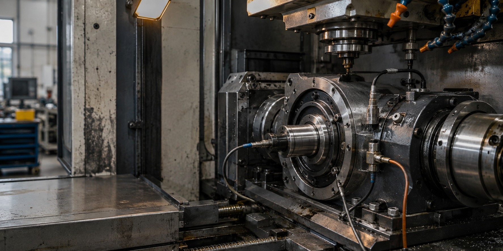
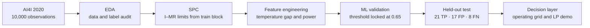
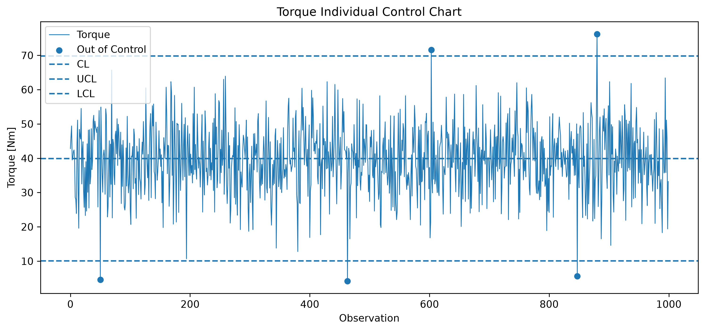
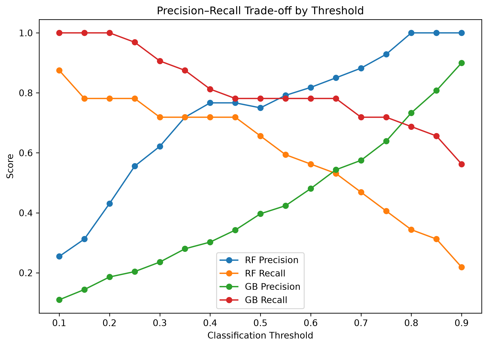
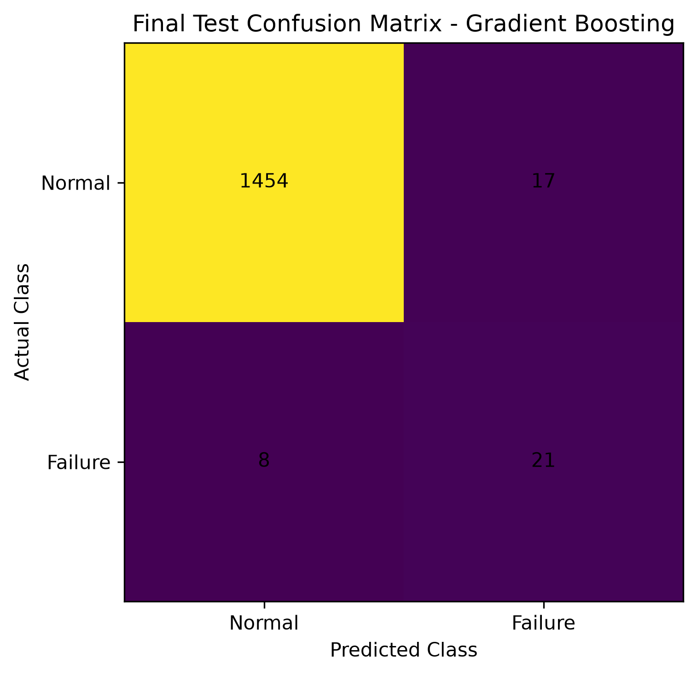
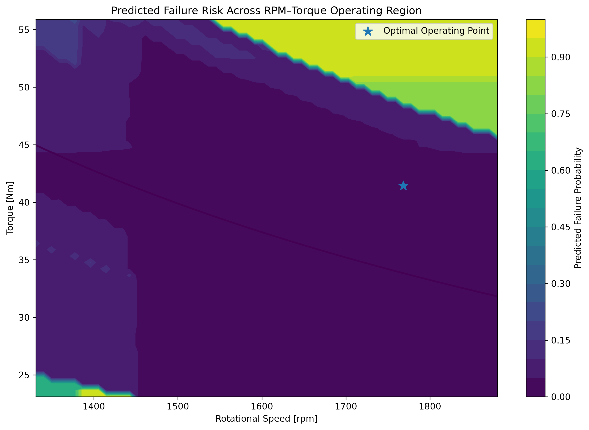

# 위험 인지형 예지보전 의사결정 시스템

> 공정 이상 감시에서 고장 예측, 운전 조건 탐색, 정비 계획까지 하나의 검증 가능한 흐름으로 연결한 산업공학 개인 연구입니다.

[](https://www.python.org/)
[](https://github.com/doyunsin883-debug/risk-aware-predictive-maintenance/actions/workflows/quality.yml)
[](LICENSE)
[](DATA_AND_ASSET_NOTICE.md)
[](reports/)

[한국어 논문 (PDF)](reports/risk_aware_predictive_maintenance_paper_ko.pdf) · [English paper (PDF)](reports/risk_aware_predictive_maintenance_paper_en.pdf) · [재현 안내](REPRODUCIBILITY.md) · [모델 카드](MODEL_CARD.md) · [English README](README_EN.md)



<sub>그림 1. 연구 흐름을 설명하기 위한 생성형 이미지이며 실험 결과가 아닙니다. 생성 경위는 [데이터·자산 고지](DATA_AND_ASSET_NOTICE.md)에 기록했습니다.</sub>

## 한눈에 보는 결과

| 항목 | 고정 테스트 결과 | 해석 |
|---|---:|---|
| 데이터 | 10,000건 / 고장 339건 | 고장률 3.39%의 불균형 이진 분류 |
| 결정 임계값 | 0.65 | 검증 세트에서 선택한 뒤 테스트 전에 고정 |
| Recall | **0.7241** | 테스트 고장 29건 중 21건 탐지 |
| Precision | **0.5526** | 경보 38건 중 실제 고장 21건 |
| PR-AUC | **0.7463** | 희소한 양성 클래스의 순위 성능 |
| ROC-AUC | **0.9615** | 전체 임계값에서의 분리 성능 |
| 운전점 탐색 | 1,999 / 3,600개 제약 충족 | 보고점 1,768.339 rpm, 41.446 Nm, 예측 점수 1.3046% |

이 저장소의 핵심은 높은 정확도 한 줄이 아니다. 어떤 기준 구간에서 공정 한계를 만들었는지, 임계값을 언제 고정했는지, 몇 건을 놓쳤는지, 최적화 결과가 어떤 가정에 의존하는지를 함께 남겼다.

## 연구 질문

1. 관리도는 희소 고장을 조기에 선별하는 데 어느 정도 도움이 되는가?
2. 물리 기반 파생변수와 SPC 경보를 결합하면 고장 판별력을 높일 수 있는가?
3. 고정된 모델 점수를 운전 조건 및 정비 계획의 제약식으로 연결할 수 있는가?



## 무엇을 다르게 했는가

- **순서 보존 분할**: 행 순서를 의사시간으로 보고 70/15/15 연속 구간으로 분할했다. 무작위 셔플로 미래 정보를 섞지 않았다.
- **기준 구간 고정**: I–MR 관리한계는 학습 블록에서만 산출하고 검증·테스트 구간에 그대로 적용했다.
- **물리량 기반 특징**: 온도차와 `토크 × 각속도`로 계산한 기계적 동력을 추가했다.
- **불균형 지표 사용**: accuracy보다 recall, precision, PR-AUC와 오분류 건수를 중심으로 판단했다.
- **결정 규칙 잠금**: Gradient Boosting과 임계값 0.65를 검증 데이터에서 선택한 뒤 테스트 결과를 확인했다.
- **예측 이후까지 연결**: 속도–토크 격자 탐색, 공구 마모 민감도, 8시간 2모드 선형계획 예제를 제시했다.

## 증거로 읽는 결과

| 모델 | Precision | Recall | F1 | PR-AUC |
|---|---:|---:|---:|---:|
| Logistic Regression | 0.250 | 0.688 | 0.367 | 0.446 |
| Random Forest | 0.750 | 0.656 | 0.700 | 0.746 |
| Gradient Boosting | 0.397 | **0.781** | 0.526 | **0.772** |

위 표는 기본 임계값 0.50의 **검증** 결과다. Gradient Boosting을 선택한 뒤 임계값을 0.65로 조정하면 검증 F1은 0.641(25 TP, 21 FP, 7 FN)이었다. 마지막 테스트에서는 TN 1,454, FP 17, FN 8, TP 21을 기록했다.

| SPC 변수 | 검증 경보율 | 고장 탐지율 | 경보 내 고장률 | 위험도 배수 |
|---|---:|---:|---:|---:|
| Torque | 1.33% | 12.50% | 20.00% | 9.38× |
| Mechanical power | 1.47% | 12.50% | 18.18% | 8.52× |
| RPM | 3.80% | 18.75% | 10.53% | 4.93× |

온도차는 학습 평균 9.610 K에서 검증 평균 10.924 K로 이동했고, 고정 관리한계 적용 시 검증 경보율이 96.13%에 달했다. 따라서 온도차 경보를 예측 특징으로 채택하지 않고 **기준선 변화 신호**로 해석했다.

| 공정 감시 | 모델 검증 | 최종 테스트 | 의사결정 |
|---|---|---|---|
|  |  |  |  |

## 빠른 재현

직렬화 모델은 신뢰한 저장소에서만 내려받아 사용해야 한다. 정확한 재현 환경은 Python 3.14.0과 `requirements-reproduce.txt`에 기록했다.

```bash
git clone https://github.com/doyunsin883-debug/risk-aware-predictive-maintenance.git
cd risk-aware-predictive-maintenance
python -m venv .venv
# Windows: .venv\Scripts\activate
# macOS/Linux: source .venv/bin/activate
python -m pip install -r requirements-reproduce.txt
python scripts/verify_artifacts.py
python scripts/reproduce_core_results.py --verify
```

예상 핵심 출력은 `threshold=0.65`, `TN=1454`, `FP=17`, `FN=8`, `TP=21`, `PR-AUC=0.7463`이다. 전체 분석 흐름은 아래 순서로 읽는다.

```text
notebooks/01_eda.ipynb
notebooks/02_sqc.ipynb
notebooks/03_ml.ipynb
notebooks/04_optimization.ipynb
```

## 저장소 구조

```text
.
├── assets/                 # 논문용 생성 이미지와 출처 고지
├── data/                   # 원자료 및 단계별 처리 데이터
├── docs/                   # 방법론·결과 해설
├── figures/                # EDA, SQC, ML, 최적화 실증 그림
├── models/                 # 고정 모델·특징·임계값·관리한계
├── notebooks/              # 01 EDA → 04 Optimization
├── reports/                # 한국어/영어 논문 DOCX·PDF
├── results/                # 기준 지표와 SHA-256 명세
├── scripts/                # 재현·무결성·점수화 도구
├── src/risk_pm/            # 재사용 가능한 핵심 함수
└── tests/                  # 특징·SPC·평가 로직 단위 테스트
```

## 정직한 해석 범위

이 결과는 **현장 배포 성능이나 고장 확률의 인과 추정치가 아니다**. AI4I는 합성 데이터이고 행 순서는 실제 타임스탬프가 아니다. 단일 연속 분할, 미보정 모델 점수, 제한된 고장 표본, 고정 시나리오의 격자 탐색과 예시적 위험 예산이라는 제약이 있다. 특히 보고 운전점은 유일한 연속 최적해가 아니라 표본 격자 안의 동률 최소점 중 하나다. 자세한 내용은 [연구 방법론](docs/methodology.md)과 논문의 한계 절을 참고한다.

## 저자·연구 상태·AI 사용

- **저자**: 신도윤 (Doyun Shin), 가천대학교 산업공학과
- **상태**: 개인 연구 원고 및 재현 가능한 포트폴리오. 학술지 게재 또는 심사 통과를 주장하지 않는다.
- **AI 보조**: 연구 과정에서 생성형 AI는 주로 일부 Python 코드 초안과 디버깅에 사용되었으며, 원고의 언어·레이아웃 정리에도 보조적으로 사용되었다. 콘셉트 이미지 2종은 이미지 생성 도구로 제작했다. 모든 수치·표·실증 그림은 저장된 데이터, 노트북, 모델 산출물과 대조했고, 연구 질문·분석 선택·해석·최종 책임은 저자에게 있다.

## 데이터와 인용

AI4I 2020 데이터는 UCI Machine Learning Repository에서 CC BY 4.0으로 제공된다. 원 데이터와 관련 논문은 아래와 같다.

- Matzka, S. (2020). *Explainable Artificial Intelligence for Predictive Maintenance Applications*. DOI: [10.1109/AI4I49448.2020.00023](https://doi.org/10.1109/AI4I49448.2020.00023)
- UCI Machine Learning Repository. *AI4I 2020 Predictive Maintenance Dataset*. DOI: [10.24432/C5HS5C](https://doi.org/10.24432/C5HS5C)

코드는 [MIT License](LICENSE), 데이터와 생성 이미지의 조건은 [별도 고지](DATA_AND_ASSET_NOTICE.md)를 따른다. 이 연구를 인용하려면 [CITATION.cff](CITATION.cff)를 사용한다.
